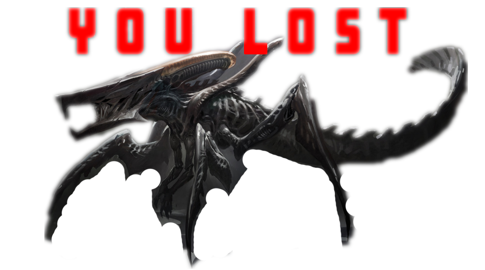

# Web based game for Starship Troopers anniversary edition

https://cangelozzi.github.io/camillo_jeril_starshipTrooperGame/. 

Build with HTML5, CSS3 and Javascript.

Contributors: **Camillo Angelozzi** and **Jeril Kadvan**.

*“…a requirement for a good soldier is to focus, remind, and have a high degree of concentration…

In the United Citizen Federation, civilians and citizens are tested for psychic abilities. Of those whom possess these abilities and pass a certain test, statuses are usually obtained within the Federal Armed Services, usually as an officer. It is assumed that a Psychic is usually offered with a position in Military Intelligence…”*

**INTRO TO GAME**
The Game Introduction Page was created using Adobe After Effect, beside a looped animation, it includes some basic rules to follow.

**GAME LAYOUT**
The game is structured in a four-by-four grid.  The grid will have 16 blocks, and in each block, there will be an alien bug hidden.

**GAME MECHANIC**
Player will need to search for the alien bugs pair hidden in the blocks.  Clicking in each block, an alien bug will be revealed; the player will need to memorize the alien color and position, trying to find the matching block with the same type/color of alien bug.  
Game is based on 20 seconds time, win or loose!

**WIN SITUATION**
The player will click in two blocks finding exactly the same type of alien bug color.  In this winning case, the blocks will stay open revealing the spotted aliens.  Player will have to match the pair within 20 seconds time.

**LOSE SITUATION**
The player will not match the alien bug type/color after clicking in two blocks.  The blocks will close, and player must memorize the position and what was inside the block.  Player not matching the alien bags within 20 seconds.

**STEPS TO BUILD THE GAME**
1. Basic HTML / CSS structure
2. "Blocks Mechanic" using CSS3 transform.  
3. Styling Alien Bugs with Adobe Illustrator.
4. Create 8 type of alien bugs with 8 colors.
5. Blocks status and interaction using Function Object Creator, and creating instances of it.
6. Object is holding various methods related to different status: gameSetup, reset, gameCheck.
7. Create a basic timer function.
8. Create and implement Intro page, final loosing/winning screen.

**LEARNING**
The Game is completely based on Vanilla Javascript.  Great learning points including DOM elements manipulation, events, array methods, and Object Creator including interaction with various methods.

